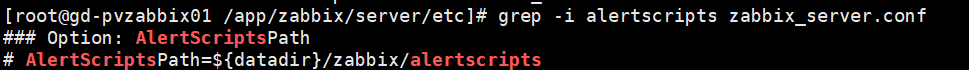
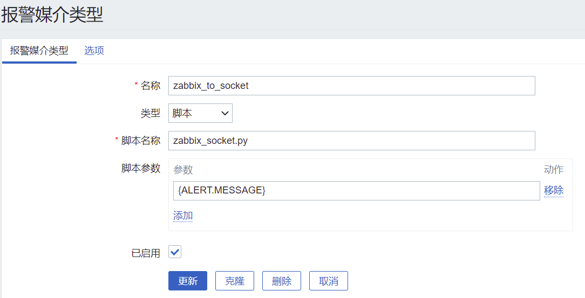
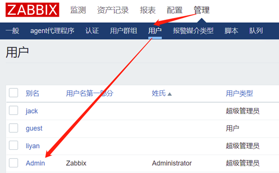
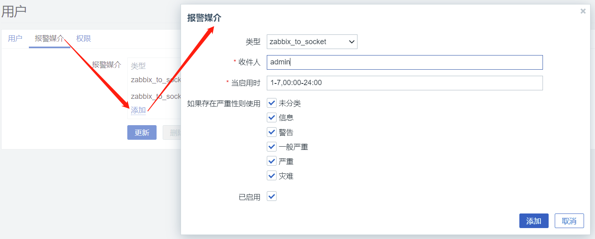
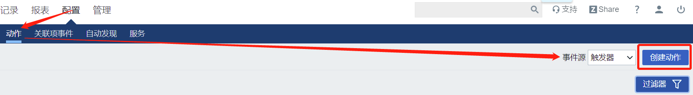
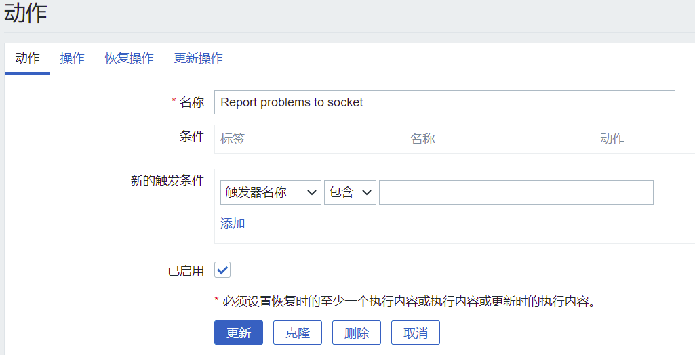
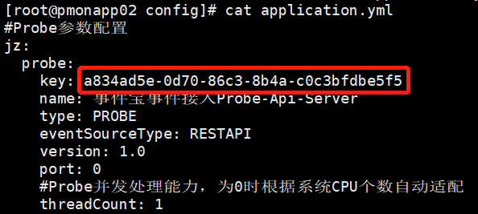
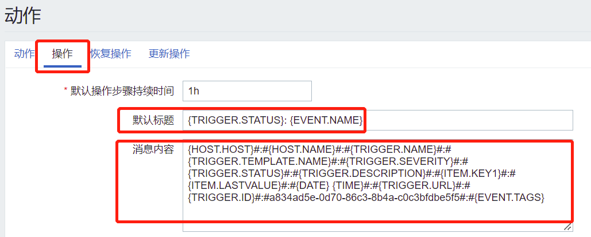
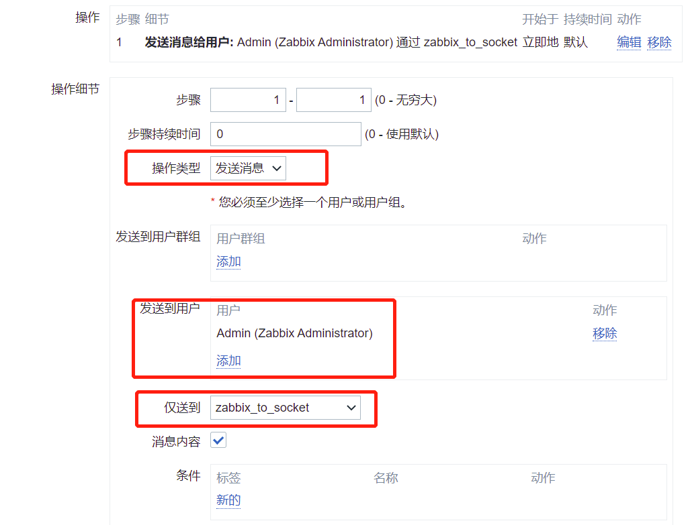
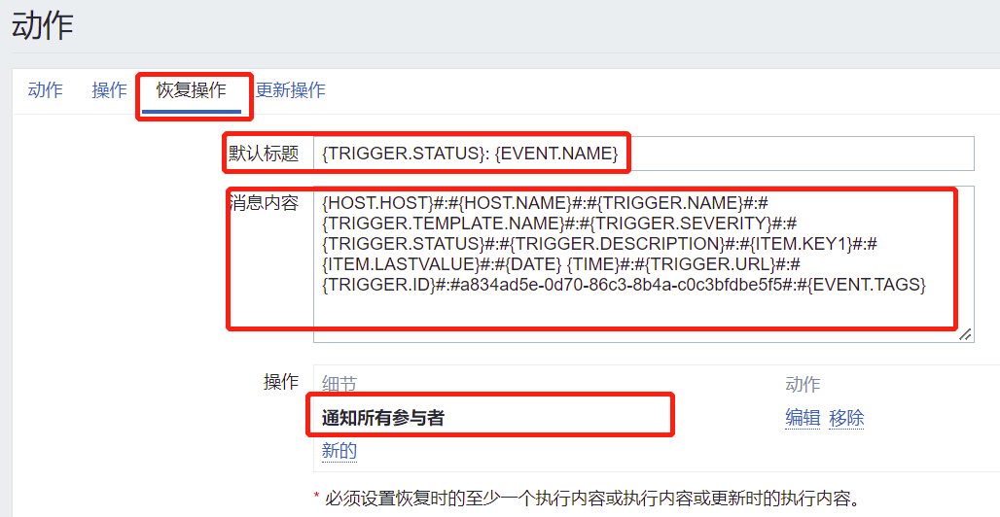

# 事件宝

#### 介绍
事件宝是竭峙(jiezhi)信息自主设计、研发的IT数据中心事件管理平台，提供事件接入、处置策略配置、通知策略配置等全流程事件处理。核心功能包括：
1. 事件管理：可对事件进行统一的查看，搜索。
2. 配置管理：可新增事件接入、处置策略、通知策略，处置策略包括事件压缩、事件恢复、事件分组、事件升降级、事件屏蔽等。

事件宝功能由前端配置操作、后端事件处理两部分组成。前端配置操作负责平台运行所需的参数配置，参数包括事件接入、处理策略、事件通知分享策略、事件人工操作等。后端事件处理程序读取前端配置操作配置的参数进行事件处理。告警处理后端从事件接入、事件处理、事件转发分阶段对事件进行处理。

#### 安装
安装四步走：

###### 1. 前置检查
1). 前提需要将防火墙以及SELinux都关闭。

使用命令
顺序|命令|说明
---|---|---
1 | setenforce 0 | 临时关闭SELinux
2 | sed -i 's#SELINUX=enforcing#SELINUX=disabled#' /etc/selinux/config | 永久关闭SELinux
3 | systemctl disable firewalld.service | 禁用防火墙服务
4 | systemctl stop firewalld.service | 关闭防火墙服务

2). 部署软件

安装准备前，一台系统为 CentOS7.X 的虚拟机或物理机，并安装完成 PostgreSQL、Tomcat、JDK软件，简单 yum 安装或源码编译安装即可。
软件版本如下：
顺序|命令|说明
---|---|---
1|PostgreSQL 13.7|PostgreSQL数据库版本
2|Tomcat 9.0.64|Tomcat版本
3|JDK 1.8|JDK版本

##### 2. 介质下载
    事件宝平台介质包下载完毕之后，上传至/tmp/plugin目录
使用命令
顺序|命令|说明
---|---|---
1|mkdir -p /tmp/plugin|创建介质存放目录
2|cd /tmp/plugin|进入介质存放目录
3|wget https://gitee.com/shijianbao/ueh/attach_files/1112933/download/ueh-probe.zip|事件宝Probe接入文件
4|wget https://gitee.com/shijianbao/ueh/attach_files/1112934/download/ueh-database.zip|事件宝数据库文件
5|wget https://gitee.com/shijianbao/ueh/attach_files/1112935/download/ueh-backend.zip|事件宝后端服务
6|wget https://gitee.com/shijianbao/ueh/attach_files/1112936/download/ueh-front.zip|事件宝前端服务
7|unzip ueh-probe.zip|解压事件宝Probe接入文件
8|unzip ueh-database.zip|解压事件宝数据库文件
9|unzip ueh-backend.zip|解压事件宝后端服务
10|unzip ueh-front.zip|解压事件宝前端服务

##### 3. 初始化数据库
	针对于已安装的PostgreSQL数据，首先要做的工作的是初始化PostgreSQL数据库。
介质目录|部署文件|说明
---|---|---
ueh-database|ueh_all.sql|事件宝数据库文件

使用命令
顺序|命令|说明
---|---|---
1|su - postgres|切换至PostgreSQL的postgres用户
2|cd /tmp/plugin/ueh-database|进入事件宝数据库存放目录
3|psql <ueh_all.sql|导入事件宝数据库

##### 4. 告警平台部署
    告警平台是使用微服务方式部署，主要是通过jar包方式运行。
1). 介质说明

介质目录|文件名称|说明
---|---|---
ueh-backend|ueh-dispatcher.zip|事件分发
ueh-backend|ueh-transmit-default.zip|通知处理
ueh-probe|ueh-probe-api-server.zip|ZABBIX事件接入
ueh-backend|ueh-handler-default.zip|ZABBIX事件处理

2). 目录说明
    以ueh-probe-api-server.zip为例,说明文件如下

顺序|路径|说明
---|---|---
1|config/application.yml|Spring Boot配置文件
2|config/log4j2.xml|日志配置文件
3|lib/|依赖jar包目录
4|ueh-probe-api-server.jar|主程序jar包

在config/log4j2.xml日志配置文件，日志默认存放路径为/var/log，可以通过以下参数修改日志路径及名称

    <property name="LOG_HOME">/var/log </property>
    <RollingFile name="rollingFile" fileName="${LOG_HOME}/ueh-probe-api-server.log" filePattern="${LOG_HOME}/$${date:yyyy}/ueh-probe-api-server-%d{yyyy-MM-dd}-%i.log">

3). 告警平台部署
    针对于介质说明中的四个部分进行安装部署，安装前需要创建程序安装目录/app/ueh目录

使用命令
顺序|命令|说明
---|---|---
1|mkdir -p /app/ueh|创建事件宝运行目录

    需要修改ueh-handler-default、ueh-transmit-default文件名称下面config目录的application.yml文件连接PostgreSQL数据库的地址、用户名、密码
    
1. ueh-handler-default

使用命令
顺序|命令|说明
---|---|---
1|cd /tmp/plugin/ueh-backend|进入介质存放目录
2|unzip ueh-handler-default.zip|解压ueh-handler-default介质
3|mv ueh-handler-default /app/ueh|复制安装文件至程序安装目录
4|vim /app/ueh/ueh-handler-default/config/application.yml|打开ueh-handler-default的配置文件
5|jdbc:postgresql://localhost:5432/ueh?currentSchema=ueh_admin&TimeZone=PRC   username: root   password: 123456|修改handler连接PostgreSQL数据库的地址、用户名、密码
6|cd /app/ueh/ueh-handler-default/|切换至程序根目录
7|nohup java -jar ueh-handler-default.jar 2>&1 &|启动模块

2. ueh-transmit-default

使用命令
顺序|命令|说明
---|---|---
1|cd /tmp/plugin/ueh-backend|进入介质存放目录
2|unzip ueh-transmit-default.zip|解压ueh-transmit-default介质
3|mv ueh-transmit-default /app/ueh|复制安装文件至程序安装目录
4|vim /app/ueh/ueh-transmit-default/config/application.yml|打开ueh-transmit-default的配置文件
5|jdbc:postgresql://localhost:5432/ueh?currentSchema=ueh_admin&TimeZone=PRC  username: root password: 123456|修改transmit连接PostgreSQL数据库的地址、用户名、密码
6|cd /app/ueh/ueh-transmit-default|切换至程序根目录
7|nohup java -jar ueh-transmit-default.jar 2>&1 &|启动模块

3. ueh-dispatcher

使用命令
顺序|命令|说明
---|---|---
1|cd /tmp/plugin/ueh-backend|进入介质存放目录
2|unzip ueh-dispatcher.zip|解压ueh-dispatcher介质
3|mv ueh-dispatcher /app/ueh|复制安装文件至程序安装目录
4|cd /app/ueh/ueh-dispatcher/|切换至程序根目录
5|nohup java -jar ueh-dispatcher.jar 2>&1 &|启动模块

4. ueh-probe-api-server

使用命令
顺序|命令|说明
---|---|---
1|cd /tmp/plugin/ueh-probe|进入介质存放目录
2|unzip ueh-probe-api-server.zip|解压ueh-probe-api-server介质
3|mv ueh-probe-api-server /app/ueh|复制安装文件至程序安装目录
4|cd /app/ueh/ueh-probe-api-server/|切换至程序根目录
5|nohup java -jar ueh-probe-api-server.jar 2>&1 &|启动模块

##### 5. 前端配置

前端配置是基于tomcat的容器进行部署，例如tomcat部署在/app/apache-tomcat-9.0.64目录
介质目录|部署文件|说明
---|---|---
ueh-front|admin-web.war|后端文件
ueh-front|admin-ui|static、favicon.ico、index.html

执行命令
顺序|命令|说明
---|---|---
1|cp /tmp/plugin/ueh-front/admin-web.war /app/apache-tomcat-9.0.64/webapps|拷贝admin-web.war至tomcat的webapps目录下
2|cp -a /tmp/plugin/ueh-front/admin-ui/* /app/apache-tomcat-9.0.64/webapps/ROOT/|拷贝前端文件至tomcat的webapps/ROOT目录下
3|sh /app/apache-tomcat-9.0.64/bin/startup.sh|启动tomcat
4|sh /app/apache-tomcat-9.0.64/bin/stop.sh|等待10秒之后，停止tomcat
5|cd /app/apache-tomcat-9.0.64/webapps/admin-web/WEB-INF/classes|进入admin-web文件夹
6|vi application-druid.yml|编辑配置数据库连接配置文件并保存退出
7|url: jdbc:postgresql://localhost:5432/ueh?currentSchema=ueh_admin &useUnicode=true&characterEncoding=utf8 &zeroDateTimeBehavior=convertToNull&useSSL=true&serverTimezone=GMT username: root password: password|修改PostgreSQL的地址、用户名、密码
8|sh /app/apache-tomcat-9.0.64/bin/startup.sh|启动tomcat

在浏览器中输入http://<tomcatIP>，当出现如下界面，则表示操作安装成功。

##### 6. Zabbix告警接入
    前提条件，Zabbix监控系统已部署成功且正常使用。

介质目录|部署文件|说明
---|---|---
ueh-probe|zabbix_socket.py|zabbix与告警平台接入文件

1).	上传介质

介质名称：zabbix_socket.py
Zabbix告警集成的脚本需要上传zabbix_server.conf定义的alertscripts目录下。
Alertscripts目录截图：

${datadir}这个变量：<zabbix的安装目录>/share，例如：zabbix的编译安装目录是/app/zabbix/server,那么对应的AlertScriptPath=/app/zabbix/server/share/zabbix/alertscripts

使用命令

顺序|命令|说明
---|---|---
1|将/tmp/plugin/zabbix_socket.py上传至zabbix服务器|
2|cp /tmp/zabbix_socket.py /app/zabbix/server/share/zabbix/alertscripts|拷贝的目录参考Alertscripts目录截图
3|cd /app/zabbix/server/share/zabbix/alertscripts|进入alertscripts目录
4|vim zabbix_socket.py|修改zabbix集成文件
5|ProbeIP = "127.0.0.1"|修改ProbeIP的地址、参考ueh-probe-api-server的部署地址
6|修改完之后，先按ESC，使用:wq保存退出|	

2).	配置媒介

此部分主要是在zabbix的前端web页面进行操作配置
登录zabbix, 选择管理=》示警媒介类型 =》创建媒体类型。如下图所示：

点击创建媒体类型界面填写信息：

    名称：zabbix_to_socket，可自定义名称
    类型：选择“脚本”
    脚本名称：zabbix_socket.py,上传的脚本文件名称
    脚本参数：{ALERT.MESSAGE}，必须填写为{ALERT.MESSAGE}，这个是zabbix触发器动作定义的告警内容

将创建的示警媒介类型配置到用户组 ，选择管理=》成员，点击“admin”用户

点击“报警媒介”，选择“添加”打开报警媒介配置界面

    类型：选择配置的媒介名称
    收件人：配置admin

配置完成之后，点击报警媒介配置界面里的“添加”，添加完成之后，点击“更新”完成配置。

3).	创建触发器动作

此部分主要是在zabbix的前端web页面进行操作配置
登录zabbix, 选择配置=》动作 =》事件源“触发器”，点击“创建动作”。如下图所示：

    
打开触发器动作的配置页面

    名称：自定义触发器名称
    条件：新的触发条件可以设置为空，则会将所有的告警推送至事件宝平台

动作页面里的操作部分，主要设置默认主题，消息内容，操作部分。

故障操作页面修改标红框部分

    默认主题：{TRIGGER.STATUS}: {EVENT.NAME}
    消息内容：
    {HOST.HOST}#:#{HOST.NAME}#:#{TRIGGER.NAME}#:#{TRIGGER.TEMPLATE.NAME}#:#{TRIGGER.SEVERITY}#:#{TRIGGER.STATUS}#:#{TRIGGER.DESCRIPTION}#:#{ITEM.KEY1}#:#{ITEM.LASTVALUE}#:#{DATE} {TIME}#:#{TRIGGER.URL}#:#{TRIGGER.ID}#:#a834ad5e-0d70-86c3-8b4a-c0c3bfdbe5f5#:#{EVENT.TAGS}
    特别注意：a834ad5e-0d70-86c3-8b4a-c0c3bfdbe5f5，这个probeID需要从ueh-zabbix-api-server的配置文件中的key获取

 
操作细节部分修改标红部分

恢复操作页面修改标红框部分

    默认主题：{TRIGGER.STATUS}: {EVENT.NAME}
    消息内容：
    {HOST.HOST}#:#{HOST.NAME}#:#{TRIGGER.NAME}#:#{TRIGGER.TEMPLATE.NAME}#:#{TRIGGER.SEVERITY}#:#{TRIGGER.STATUS}#:#{TRIGGER.DESCRIPTION}#:#{ITEM.KEY1}#:#{ITEM.LASTVALUE}#:#{DATE} {TIME}#:#{TRIGGER.URL}#:#{TRIGGER.ID}#:#a834ad5e-0d70-86c3-8b4a-c0c3bfdbe5f5#:#{EVENT.TAGS}
    特别注意：a834ad5e-0d70-86c3-8b4a-c0c3bfdbe5f5，这个probeID需要从ueh-zabbix-api-server的配置文件中的key获取
    操作：选择通知所有参与者

#### 交流

扫描微信加群：

